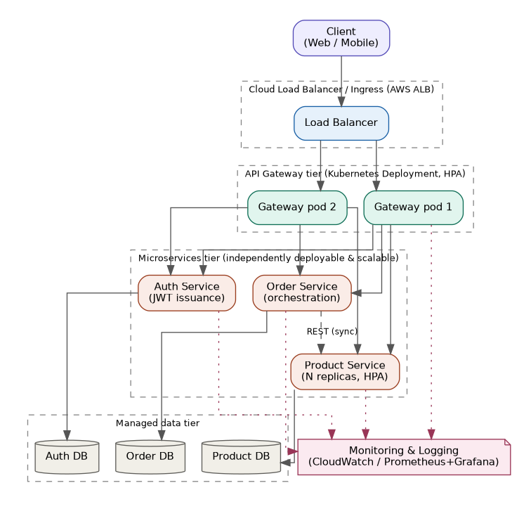

# Cloud-Native Microservices Architecture for Scalable Web Applications

Reference implementation and empirical performance evaluation accompanying the IEEE-format research paper of the same name.

**Live demo:** _https://cloud-native-microservices-demo-0ur2.onrender.com_
**Paper (PDF):** [`IEEE_Paper_Cloud_Native_Microservices.pdf`](./IEEE_Paper_Cloud_Native_Microservices.pdf)



## What this is

A small e-commerce style application (login, product catalog, order placement) implemented **twice**, byte-identical in business logic, so the two implementations can be fairly compared:

- **`services/`** — four independent microservices (Auth, Product, Order, API Gateway), each its own process, communicating over real HTTP.
- **`monolith/`** — the same functionality as one single process, for baseline comparison.

Both were benchmarked under identical load using [`autocannon`](https://github.com/mcollina/autocannon), and the raw results, charts, and full methodology are written up in the accompanying paper.

## Repository structure

```
services/            Auth, Product, Order, and Gateway microservices (Express)
monolith/             Single-process baseline implementation
demo/server.js         Bundles all 4 microservices into one deployable process (for free-tier hosting)
public/                Static frontend (login / catalog / place order) for the live demo
docker-compose.yml      Local multi-container orchestration
Dockerfile.demo         Container image used for the live demo deployment
render.yaml             Render.com one-click deploy blueprint
k8s/                    Kubernetes manifests (Deployments, Services, HPA, Ingress) for production
terraform/              Terraform for AWS EKS + ECR provisioning
benchmarks/             Load-test runner script + raw JSON results
charts/                 Scripts + generated figures (architecture diagram, performance charts)
docs/DEPLOYMENT.md      Full step-by-step AWS/Azure/GCP deployment guide
IEEE_Paper_Cloud_Native_Microservices.docx / .pdf   The research paper
```

## Running it locally

**Option A — Docker Compose (closest to the real architecture, separate containers):**
```bash
docker compose up --build
curl http://localhost:4000/api/products
```

**Option B — plain Node (fastest to try):**
```bash
npm install
PORT=4001 node services/auth/index.js &
PORT=4002 node services/product/index.js &
PORT=4003 PRODUCT_SERVICE_URL=http://localhost:4002 node services/order/index.js &
PORT=4000 AUTH_URL=http://localhost:4001 ORDER_URL=http://localhost:4003 PRODUCT_URLS=http://localhost:4002 node services/gateway/index.js &
curl http://localhost:4000/api/products
```

**Option C — the bundled demo (one process, what the live demo runs):**
```bash
npm install
PORT=8080 node demo/server.js
# open http://localhost:8080 in a browser
```

## Reproducing the benchmarks

```bash
npm install
bash benchmarks/run_benchmarks.sh      # starts everything, runs autocannon, saves JSON to benchmarks/results/
python3 charts/make_architecture_diagram.py
python3 benchmarks/make_charts.py      # regenerates the figures used in the paper from that JSON
```

## Deploying the live demo

The full architecture (4 separate scalable microservices behind a Kubernetes-managed gateway) is meant for a real cluster — see [`docs/DEPLOYMENT.md`](./docs/DEPLOYMENT.md) for the complete AWS EKS / Terraform path. For a **free, public, clickable demo**, this repo also includes a bundled version (`demo/server.js`) that runs the same four services as real internal processes inside one container, so it fits a free hosting plan's single exposed port.

To deploy on [Render](https://render.com) (free tier):
1. Push this repo to GitHub (see below).
2. On Render: **New → Blueprint**, connect this repo. Render will read `render.yaml` automatically and build `Dockerfile.demo`.
3. Wait for the build to finish; Render gives you a public URL like `https://cloud-native-microservices-demo.onrender.com`.
4. Put that URL at the top of this README and in the paper's supplementary materials note, if your venue allows one.

(Railway and Fly.io work the same way — point them at `Dockerfile.demo`.)

## Pushing this repo to GitHub

```bash
git init
git add .
git commit -m "Initial commit: cloud-native microservices reference implementation + IEEE paper"
git branch -M main
git remote add origin https://github.com/SakinaMuzzammil/cloud_native_microservices_architecture.git
git push -u origin main
```

## Citing this work

If you reference this repository or the accompanying paper, please cite:

> S. Muzzammil, "Cloud-Native Microservices Architecture for Scalable Web Applications: Design, Implementation, and Empirical Performance Evaluation," 2026.

## Author

Sakina muzzammil

## License

MIT — see [`LICENSE`](./LICENSE).
